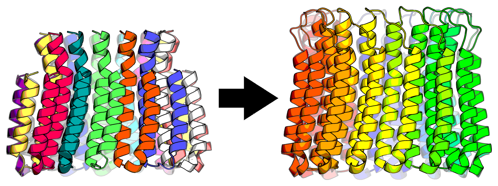
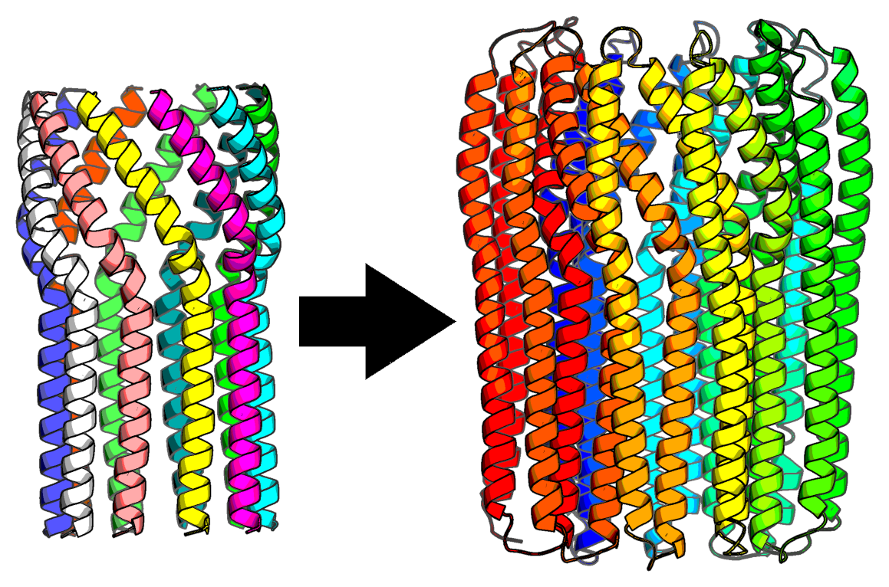

# Monomerizer
Take a PDB structure of a symmetric homo-oligomeric barrel, and monomerize without occluding the pore.

Monomerization of shortened version of PDB 2XQS is shown with only small loops added to monomerize.


Larger modifications can be made aswell such as the large helical linkers for shortened version of PDB 4JPP.


## Running Locally as a Single Command
Running requires only a PDB file as input.  In the example case we use a shortened version of the `2XQS` structure
from the RCSB.  This file can be found in the repository as `tests/pdbs/2XQS_short.pdb`.

1. Make a working directory and move over the input file
`mkdir docker_tmp`
`cp monomerizer/tests/pdbs/2XQS_short.pdb ./docker_tmp`

2. Make sure the docker deamon is started
`sudo systemctl start docker`

3. Interactively start the docker image
`sudo docker run -it --entrypoint /bin/bash -v $(pwd)/tmp_docker/:/workspace --gpus all antiquatedarachnid/monomerizer:latest`

4. Run `monomoerizer`
`python ../monomerizer/scripts/make_monomer.py 2XQS_short.pdb output --generator-steps 2 --num-designs 1 --linker-lengths 11`

## Running on the Cloud
In this example we'll run using `runpod` (https://www.runpod.io/) which will allow easy access to larger and or faster
GPUs than you might have locally.

1. Setup a template for monomerizer
Make a new runpod template with the Container Image as `antiquatedarachnid/monomerizer:latest`
Set the Docker Command to `/bin/bash`

2. Start the container
Launch the container using the `runpod` WebGUI
ssh into the pod using terminal or web-connect options

3. Copy over your desired input file
`runpodctl send myfile.pdb` on e.g. your local computer and get the `code`
`runpodctl receive {code}` on the pod

4. Run `monomerizer`
`python ../monomerizer/scripts/make_monomer.py 2XQS_short.pdb output --generator-steps 2 --num-designs 1 --linker-lengths 11`

5. Compress the results and send to your local machine
`tar -czvf outputs.tar.gz outputs`
`runpodctl send outputs.tar.gz`
`runpotctl receive {code}`

## Development
If you make changes to the code, you can locally use a the new docker image or publish your own

### Building the Container Image
`sudo docker build -t monomerizer:latest .`
- add `--no-cache` if needing a full rebuild

### Publishing the Docker Image
```
sudo docker login
sudo docker tag monomerizer:latest your_docker_id/monomerizer:latest
sudo docker push your_docker_id/monomerizer:latest
```
